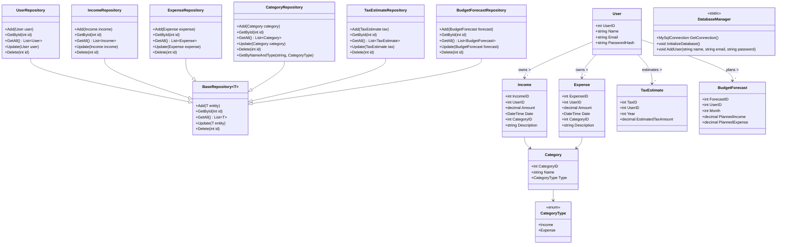

## **Stufe 1: Konzeption & Planung**

---

### **1. Projektidee**

**Titel:** Freelance Finance Manager  
**Ziel:** Entwicklung einer Desktop-/Web-Anwendung (C# + MySQL), die Freelancer bei der Verwaltung ihrer Finanzen unterstützt – mit Fokus auf variable Einkommen, Ausgaben, Steuerplanung und finanzielle Prognosen.

---

### **2. Zielgruppenanalyse & Problemdefinition**

**Zielgruppe:**

- Freelancer
    
- Gig-Worker
    
- Selbstständige mit unregelmäßigen Einnahmen
    

**Herausforderungen der Zielgruppe:**

- Schwankende Einkommensströme
    
- Fehlende Transparenz über monatliche Ausgaben
    
- Keine klare Struktur zur Steuer- oder Rücklagenplanung
    
- Keine Tools, die auf die Bedürfnisse von Freelancern zugeschnitten sind
    

**Lösungsansatz:**

- Einfache, aber leistungsfähige App mit Modulen zur Einnahmen-/Ausgabenverwaltung, Budgetprognose und Steuerplanung.
    

---

### **3. Entwurf eines ER-Diagramms (mit Erklärung)**

**Datenbankmodell – zentraler Überblick (vereinfacht):**

**Entitäten:**

- `User` (Nutzer der App)
    
- `Income` (Einnahmen)
    
- `Expense` (Ausgaben)
    
- `Category` (Kategorien für Einnahmen/Ausgaben)
    
- `TaxEstimate` (automatisch berechnete Steuerschätzung)
    
- `BudgetForecast` (geplante Einnahmen & Ausgaben)
    

```plaintext
User
- UserID (PK)
- Name
- Email
- PasswordHash

Income
- IncomeID (PK)
- UserID (FK)
- Amount
- Date
- CategoryID (FK)
- Description

Expense
- ExpenseID (PK)
- UserID (FK)
- Amount
- Date
- CategoryID (FK)
- Description

Category
- CategoryID (PK)
- Name
- Type (Income/Expense)

TaxEstimate
- TaxID (PK)
- UserID (FK)
- Year
- EstimatedTaxAmount

BudgetForecast
- ForecastID (PK)
- UserID (FK)
- Month
- PlannedIncome
- PlannedExpense
```

---

### **4. Klassendiagramm (Basisstruktur in C#)**



---

### **5. Planung des User Interfaces (GUI)**

**Technologie:** C# mit WinForms, WPF oder ASP.NET (je nach Plattform)  
**Designprinzipien:**

- Einfach, modern, responsive
    
- Finanzdashboard als Startansicht
    
- Navigation zu Modulen: Einnahmen, Ausgaben, Budget, Steuer, Einstellungen
    

**Geplante GUI-Komponenten:**

- **Dashboard:** Monatsübersicht, Saldo, Graphen
    
- **Einnahmen-/Ausgabenmaske:** + / - Button, Kategorie, Beschreibung, Betrag
    
- **Steuerschätzung:** Einfaches Tool mit %-Sätzen
    
- **Berichte & Prognosen:** Line-Charts, Balkendiagramme
    
- **Kategorieverwaltung:** Eigene Kategorien erstellen
    
