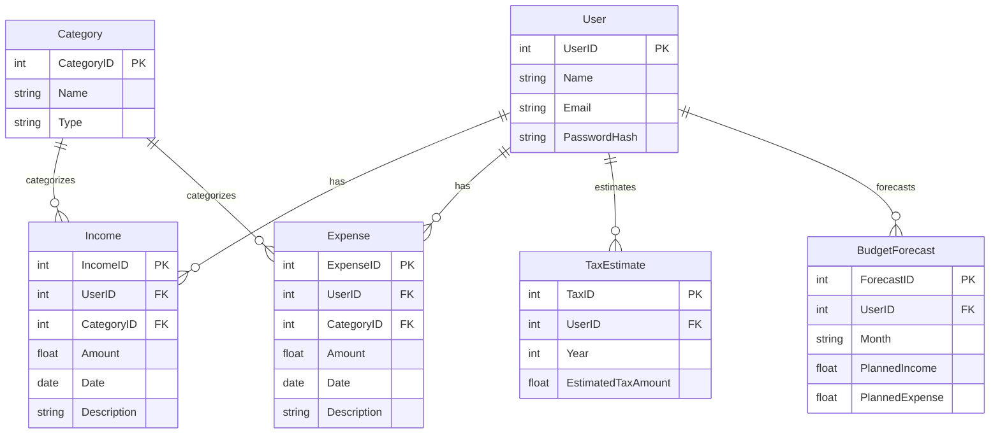

# Stufe 2: Datenbankmodellierung & Anbindung

## Übersicht

In dieser Phase wurde das relationale Datenbankmodell erstellt, die Verbindung konfiguriert und das Repository-Pattern zur Kapselung der CRUD-Operationen implementiert.

---

## 1. Datenbankschema

- **User**: UserID (PK), Name, Email, PasswordHash
    
- **Category**: CategoryID (PK), Name, Type (Income/Expense)
    
- **Income**: IncomeID (PK), UserID (FK→User), Amount, Date, CategoryID (FK→Category), Description
    
- **Expense**: ExpenseID (PK), UserID (FK→User), Amount, Date, CategoryID (FK→Category), Description
    
- **TaxEstimate**: TaxID (PK), UserID (FK→User), Year, EstimatedTaxAmount
    
- **BudgetForecast**: ForecastID (PK), UserID (FK→User), Month, PlannedIncome, PlannedExpense
	

Die Tabellen werden in `DatabaseManager.InitializeDatabase()` per SQL-Befehle erzeugt.

---

## 2. Datenbankverbindung

- **GetConnection()** liefert eine `MySqlConnection` mit den Verbindungsdaten aus `App.config`.
    
- Die Verbindung wird in allen Repository-Klassen für DB-Operationen genutzt.
    

---

## 3. Repository-Pattern

- Abstrakte Basisklasse `BaseRepository` enthält gemeinsame Hilfsmethoden.
    
- Für jede Entität existiert eine Repository-Klasse mit folgenden Methoden:
    
    - `Add(T entity)`
        
    - `GetById(int id)`
        
    - `GetAll()`
        
    - `Update(T entity)`
        
    - `Delete(int id)`
        

---

## 4. CRUD-Operationen  
Alle CRUD-Methoden wurden implementiert und beziehen sich auf:

- **IncomeRepository**
    
- **ExpenseRepository**
    
- **CategoryRepository**
    
- **TaxEstimateRepository**
    
- **BudgetForecastRepository**
    

---

## 5. Unit-Tests

- Eigene Testprojekt mit MSTest:
    
    - Je Repository eine Testklasse.
        
    - `TestInitialize`:
        
        - Datenbankinitialisierung (`InitializeDatabase()`)
            
        - Anlage von Test-Usern und ggf. Test-Kategorien
            
        - Bereinigung der jeweils zu testenden Tabelle
            
    - Tests decken alle CRUD-Methoden ab.
        
- Ausführung via `dotnet test` oder Visual Studio Test Explorer.